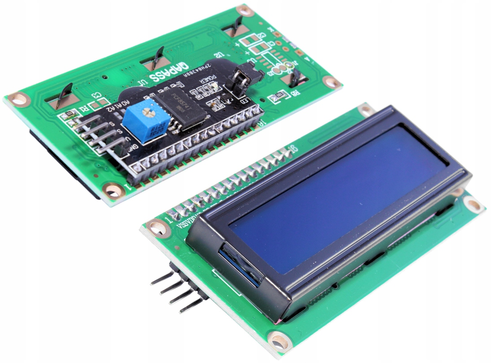
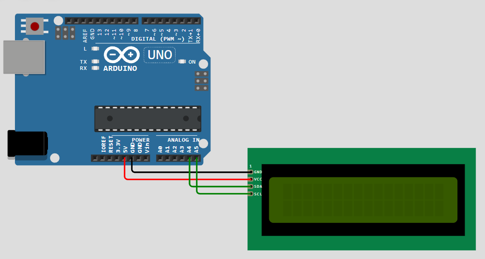

# LCD1602 I2C Arduino Project

This project demonstrates how to use a **16x2 LCD (LCD1602) with an I2C interface** in an Arduino project.  
It also shows how to create and display **custom characters** using the `LCD_I2C` library.

## Hardware Overview

### LCD1602 I2C Module
The LCD1602 with I2C adapter reduces the number of pins required to control the display, making wiring simpler and cleaner.



### Wiring Schema



### Pin Description

| Name | Description        |
|-----:|--------------------|
| GND  | Ground             |
| VCC  | Supply voltage     |
| SDA  | I2C data line      |
| SCL  | I2C clock line     |

## Software

### Custom Characters

You can define **custom characters** using the `createChar()` method of the `LCD_I2C` library.

- The LCD supports **8 custom characters**
- Character indexes range from **0 to 7**
- Once created, they can be printed on the display

#### Creating a Custom Character

```cpp
byte heart[8] = {
  0b00000,
  0b01010,
  0b11111,
  0b11111,
  0b11111,
  0b01110,
  0b00100,
  0b00000,
};

lcd.createChar(0, heart); 
```

#### Displaying a Custom Character
You can display the custom character in two ways:
- Using write(): `lcd.write((uint8_t)0);`
- Using a C string escape sequence: `lcd.print("\x00");`

#### Animation
You can modify any custom character while the program is running. This method is useful for creating simple animations. For example, change loop() in the code sample above to slowly reveal the heart icon, line-by-line:

```cpp
void loop() {
  uint8_t heart2[8] = {0};
  for (int i = 0; i < 8; i++) {
    heart2[i] = heart[i];
    lcd.createChar(3, heart2);
    delay(100);
  }
  delay(500);
}
```
