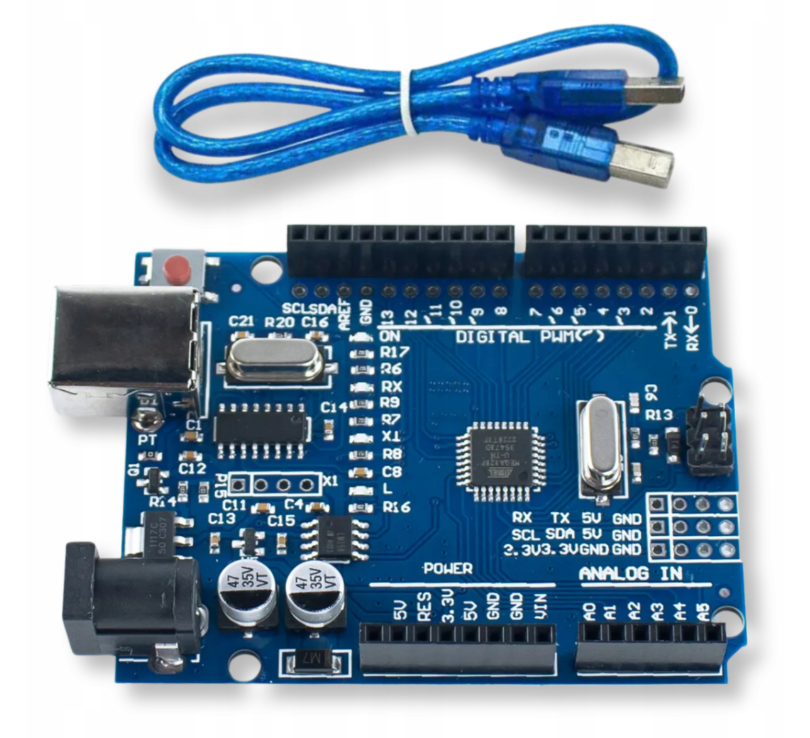
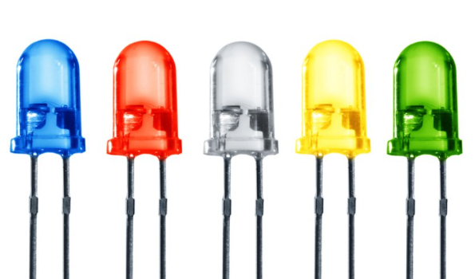
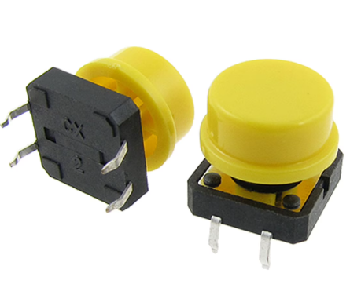
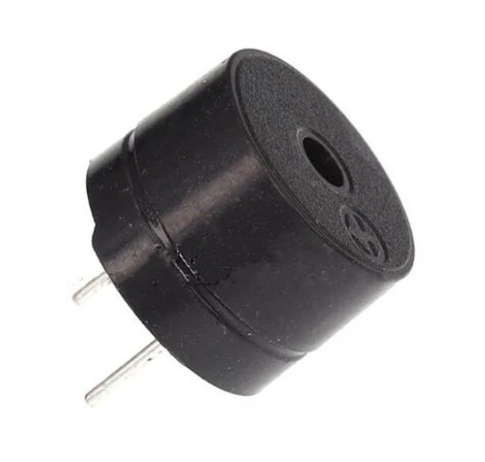
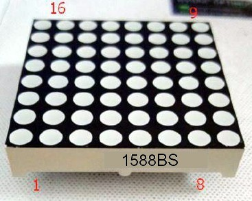
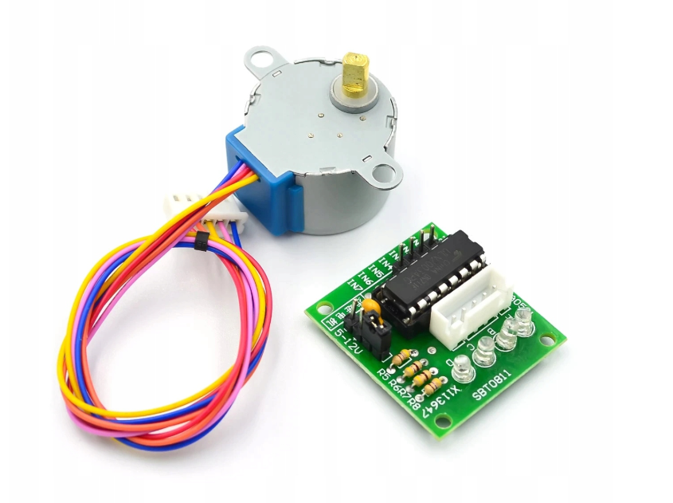
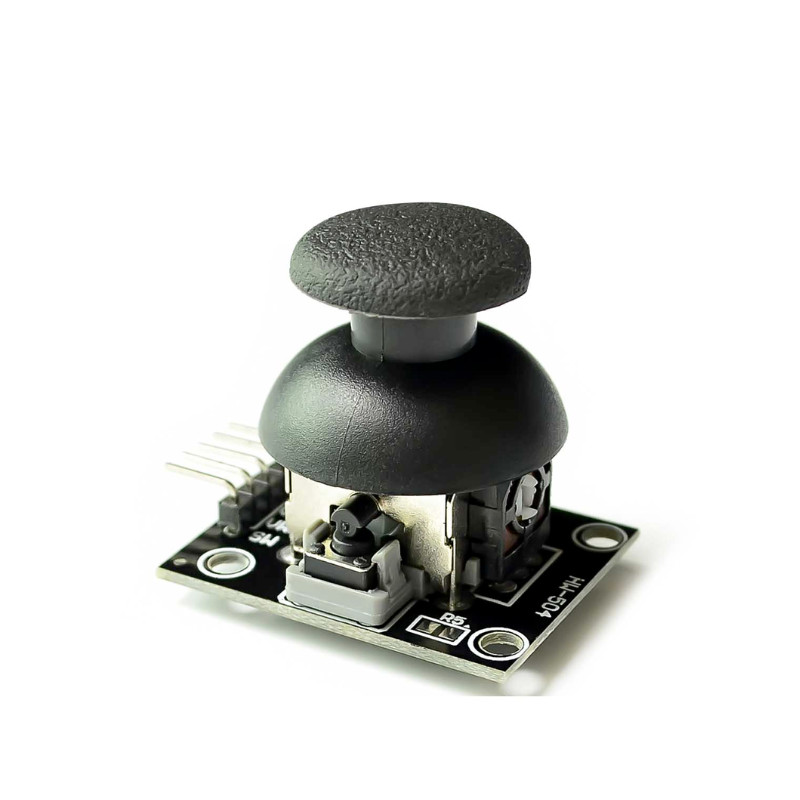
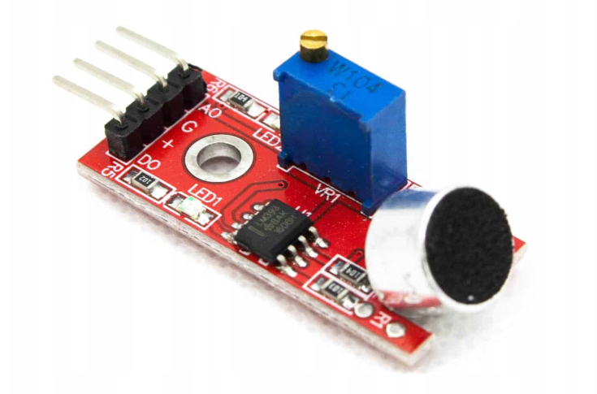
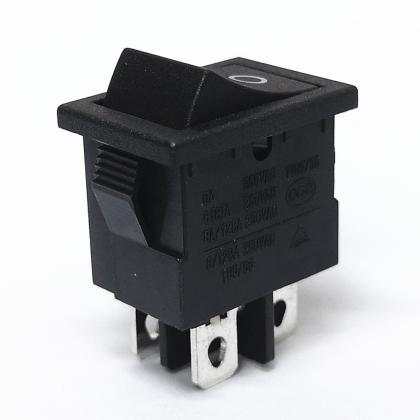

# Arduino Components Overview

This project uses an **Arduino Uno** with multiple input/output modules, sensors, and actuators.  
Below is a list of all hardware components used in the project.

| Image | Component |
|------|----------|
|  | **Arduino Uno** Main microcontroller board used to control all components and run the project logic. |
|  | **LEDs (Red, Blue, Green)** Used as visual indicators for status, signals, or debugging. |
|  | **Buttons** Provide digital input for user interaction and control actions. |
|  | **Buzzer** Generates sound alerts, notifications, or feedback. |
|  | **8×8 LED Matrix (1588BS)** Common-cathode LED matrix used to display characters, icons, and animations via row/column scanning. |
|  | **Keypad (QAPASS)** Used for numeric or character input, such as passwords or menu navigation. |
|  | **Real-Time Clock (RTC) Module** Keeps track of time and date even when the system is powered off. |
|  | **28BYJ-48 Geared Stepper Motor (12V) with Driver Module** Stepper motor with built-in gearbox, providing precise rotational control, supplied with a dedicated control board. |
|  | **Joystick HW-504** Provides analog input for directional control (X/Y axis + button). |
|  | **Microphone Module (Hoya)** Detects sound levels or audio input. |
|  | **Button Module H85/55** Dedicated button module for triggering actions or events. |
