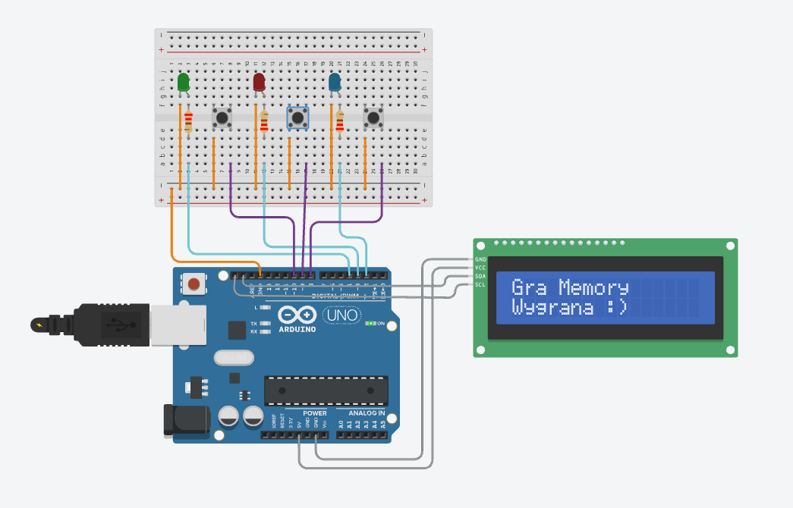

# 🎮 Arduino Memory Game

This project is a simple **Memory Game** built using **Arduino Uno**, LEDs, buttons, and an **I2C LCD 16x2** display.  
The player must remember and repeat a randomly generated sequence of LEDs.

---

## 🧠 Game Rules

1. When the game starts, Arduino generates a random sequence of LEDs.
2. The LEDs light up one by one to show the sequence.
3. The player must repeat the sequence by pressing the corresponding buttons.
4. After each button press, the LCD shows how many inputs were entered.
5. When all inputs are entered:
   - ✅ If the sequence is correct → **Win**
   - ❌ If the sequence is wrong → **Lose**
6. After a short delay, a new game starts automatically.

---

## 🧰 Components Used

- Arduino Uno
- Breadboard
- 3 × LEDs
- 3 × Push buttons
- 3 × Resistors for LEDs (e.g. 220Ω)
- Jumper wires
- LCD 16×2 with I2C interface (PCF8574)

---

## 🧩 Schematic

The wiring diagram for the project is shown below:

---

## 🔌 Pin Configuration

### LEDs
| LED | Arduino Pin |
|----|-------------|
| LED 1 | D2 |
| LED 2 | D3 |
| LED 3 | D4 |

### Buttons
| Button | Arduino Pin |
|--------|-------------|
| Button 1 | D8 |
| Button 2 | D9 |
| Button 3 | D10 |

Buttons use **INPUT_PULLUP**, so they are active LOW.

### LCD (I2C)
| LCD Pin | Arduino |
|--------|---------|
| VCC | 5V |
| GND | GND |
| SDA | A4 |
| SCL | A5 |

I2C address used: `0x27` (may vary depending on module).

---

## 🖥️ LCD Display

- **Line 1:** Game title (`Gra Memory`)
- **Line 2:** Counter of entered moves (`Licznik`)

During gameplay, the LCD updates the number of inputs entered by the player and displays the final result:
- `Wygrana :)`
- `PRZEGRANA :(`

---

